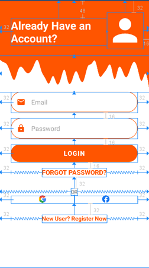
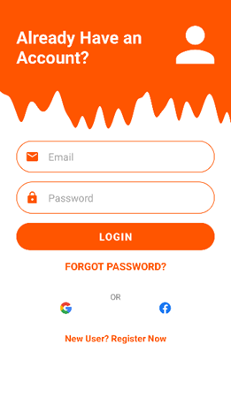

<p align = "center">МИНИСТЕРСТВО НАУКИ И ВЫСШЕГО ОБРАЗОВАНИЯ<br>
РОССИЙСКОЙ ФЕДЕРАЦИИ<br>
ФЕДЕРАЛЬНОЕ ГОСУДАРСТВЕННОЕ БЮДЖЕТНОЕ<br>
ОБРАЗОВАТЕЛЬНОЕ УЧРЕЖДЕНИЕ ВЫСШЕГО ОБРАЗОВАНИЯ<br>
«САХАЛИНСКИЙ ГОСУДАРСТВЕННЫЙ УНИВЕРСИТЕТ»</p>
<br><br><br><br><br><br>
<p align = "center">Институт естественных наук и техносферной безопасности<br>Кафедра информатики<br>Коньков Никита Алексеевич</p>
<br><br><br>
<p align = "center">Лабораторная работа №9<br><strong>«Создание интерфейсов с использованием макетов и виджетов»</strong><br>01.03.02 Прикладная математика и информатика</p>
<br><br><br><br><br><br><br><br><br><br><br><br>
<p align = "right">Научный руководитель<br>
Соболев Евгений Игоревич</p>
<br><br><br>
<p align = "center">г. Южно-Сахалинск<br>2022 г.</p>
<br><br><br><br><br><br><br><br><br><br><br><br>

<h1 align = "center">Введение</h1>

<p><b>Android Studio</b> — интегрированная среда разработки (IDE) для работы с платформой Android, анонсированная 16 мая 2013 года на конференции Google I/O. В последней версии Android Studio поддерживается Android 4.1 и выше.</p>
<p><b>Kotlin</b> — это кроссплатформенный статически типизированный язык программирования общего назначения высокого уровня. Kotlin предназначен для полного взаимодействия с Java, а версия стандартной библиотеки Kotlin для JVM зависит от библиотеки классов Java, но вывод типов позволяет сделать ее синтаксис более кратким. Kotlin в основном нацелен на JVM, но также компилируется в JavaScript (например, для интерфейсных веб-приложений, использующих React) или собственный код через LLVM (например, для собственных приложений iOS, разделяющих бизнес-логику с приложениями Android). Затраты на разработку языка несет JetBrains, а Kotlin Foundation защищает торговую марку Kotlin.</p>

<br>
<h1 align = "center">Цели и задачи</h1>

<h2 align = "center"><b> Упражнение. Сделать функциональный макет </b></h2>

<p>Необходимо реализовать макет по изображению, соблюдая отступы согласно рисунку 1.</p>

<p align = "center"></p>

<p align = "center">Рисунок 1 – Прототип макета</p>
<p align = "center"></p>
<p align = "center">Рисунок 2 – Финальный макет</p>
<p>Реализовать простую авторизацию по логину паролю, при удачной попытке вывести пользователю сообщение об авторизации, если пароль логин неверный, то сообщение об ошибке.</p>

<p>Сделать вторую Activity для восстановления пароля в стилистике рисунка 1, также сделать переход с главной Activity на вторую.</p>


<h1 align = "center">Решение</h1>

<p>Для выполнения этого задания и воспользовался двумя сайтами</p>
<ul>
<li><a href="https://angrytools.com/android/button/">Генератор кнопки и полей ввода</a></li>
<li><a href="https://getwaves.io">Волны для заднего плана</a></li>
<li><a href="https://icons8.com">Иконки профиля, почты и пароля</a></li>
</ul>
<p>

<h2 align = "center">Файл основного макета</h2>

```xml
<?xml version="1.0" encoding="utf-8"?>
<androidx.constraintlayout.widget.ConstraintLayout xmlns:android="http://schemas.android.com/apk/res/android"
    xmlns:app="http://schemas.android.com/apk/res-auto"
    xmlns:tools="http://schemas.android.com/tools"
    android:layout_width="match_parent"
    android:layout_height="match_parent"
    tools:context=".MainActivity">

    <androidx.constraintlayout.widget.ConstraintLayout
        android:id="@+id/question_table"
        android:layout_width="match_parent"
        android:layout_height="wrap_content"
        android:background="@color/orange"
        android:paddingBottom="16dp"
        app:layout_constraintEnd_toEndOf="parent"
        app:layout_constraintStart_toStartOf="parent"
        app:layout_constraintTop_toTopOf="parent">

        <TextView
            android:id="@+id/question_ask"
            android:layout_width="260dp"
            android:layout_height="wrap_content"
            android:layout_marginStart="32dp"
            android:layout_marginTop="48dp"
            android:text="@string/question_ask"
            android:textColor="@color/white"
            android:textSize="30dp"
            android:textStyle="bold"
            app:layout_constraintEnd_toStartOf="@+id/profile_image"
            app:layout_constraintHorizontal_bias="1.0"
            app:layout_constraintStart_toStartOf="parent"
            app:layout_constraintTop_toTopOf="parent" />

        <ImageView
            android:id="@+id/profile_image"
            android:layout_width="wrap_content"
            android:layout_height="wrap_content"
            android:layout_marginTop="32dp"
            android:layout_marginEnd="16dp"
            android:contentDescription="user_image"
            app:layout_constraintEnd_toEndOf="parent"
            app:layout_constraintTop_toTopOf="parent"
            app:srcCompat="@drawable/user" />

    </androidx.constraintlayout.widget.ConstraintLayout>

    <androidx.constraintlayout.widget.ConstraintLayout
        android:id="@+id/wave"
        android:layout_width="match_parent"
        android:layout_height="100dp"
        android:background="@drawable/ic_wave"
        app:layout_constraintEnd_toEndOf="parent"
        app:layout_constraintStart_toStartOf="parent"
        app:layout_constraintTop_toBottomOf="@+id/question_table"></androidx.constraintlayout.widget.ConstraintLayout>

    <androidx.constraintlayout.widget.ConstraintLayout
        android:id="@+id/login_field"
        android:layout_width="0dp"
        android:layout_marginLeft="32dp"
        android:layout_marginRight="32dp"
        android:layout_height="wrap_content"
        android:background="@drawable/field_shape"
        app:layout_constraintEnd_toEndOf="parent"
        app:layout_constraintStart_toStartOf="parent"
        app:layout_constraintTop_toBottomOf="@id/wave">

        <ImageView
            android:id="@+id/email_image"
            android:layout_width="wrap_content"
            android:layout_height="wrap_content"
            android:layout_marginStart="24dp"
            android:layout_marginTop="16dp"
            android:layout_marginBottom="16dp"
            android:contentDescription="user_image"
            app:layout_constraintBottom_toBottomOf="parent"
            app:layout_constraintStart_toStartOf="parent"
            app:layout_constraintTop_toTopOf="parent"
            app:srcCompat="@drawable/email" />

        <EditText
            android:id="@+id/login_text"
            android:layout_width="0dp"
            android:layout_height="wrap_content"
            android:layout_marginStart="24dp"
            android:layout_marginEnd="24dp"
            android:background="@android:color/transparent"
            android:hint="@string/login_username"
            android:textColor="@color/black"
            android:textColorHint="@color/gray"
            android:textSize="20dp"
            app:layout_constraintBottom_toBottomOf="parent"
            app:layout_constraintEnd_toEndOf="parent"
            app:layout_constraintStart_toEndOf="@+id/email_image"
            app:layout_constraintTop_toTopOf="parent" />

    </androidx.constraintlayout.widget.ConstraintLayout>

    <androidx.constraintlayout.widget.ConstraintLayout
        android:id="@+id/password_field"
        android:layout_width="0dp"
        android:layout_marginTop="16dp"
        android:layout_marginLeft="32dp"
        android:layout_marginRight="32dp"
        android:layout_height="wrap_content"
        android:background="@drawable/field_shape"
        app:layout_constraintEnd_toEndOf="parent"
        app:layout_constraintStart_toStartOf="parent"
        app:layout_constraintTop_toBottomOf="@id/login_field">

        <ImageView
            android:id="@+id/password_image"
            android:layout_width="wrap_content"
            android:layout_height="wrap_content"
            android:layout_marginStart="24dp"
            android:layout_marginTop="16dp"
            android:layout_marginBottom="16dp"
            android:contentDescription="password_image"
            app:layout_constraintBottom_toBottomOf="parent"
            app:layout_constraintStart_toStartOf="parent"
            app:layout_constraintTop_toTopOf="parent"
            app:srcCompat="@drawable/lock" />

        <EditText
            android:id="@+id/password_text"
            android:layout_width="0dp"
            android:layout_height="wrap_content"
            android:layout_marginStart="24dp"
            android:layout_marginEnd="24dp"
            android:background="@android:color/transparent"
            android:hint="@string/login_password"
            android:textColor="@color/black"
            android:textColorHint="@color/gray"
            android:textSize="20dp"
            app:layout_constraintBottom_toBottomOf="parent"
            app:layout_constraintEnd_toEndOf="parent"
            app:layout_constraintStart_toEndOf="@+id/password_image"
            app:layout_constraintTop_toTopOf="parent"
            android:inputType="textPassword"/>

    </androidx.constraintlayout.widget.ConstraintLayout>

    <androidx.appcompat.widget.AppCompatButton
        android:id="@+id/login_button"
        android:text="Login"
        android:textColor="#FFFFFF"
        android:textSize="23sp"
        android:layout_width="0dp"
        android:layout_marginTop="16dp"
        android:layout_marginLeft="32dp"
        android:layout_marginRight="32dp"
        android:layout_height="wrap_content"
        android:background="@drawable/login_shape"
        app:layout_constraintEnd_toEndOf="parent"
        app:layout_constraintStart_toStartOf="parent"
        app:layout_constraintTop_toBottomOf="@id/password_field"
        />

    <TextView
        android:id="@+id/login_forgot"
        android:layout_width="wrap_content"
        android:layout_height="wrap_content"
        android:layout_marginStart="32dp"
        android:layout_marginEnd="32dp"
        android:layout_marginTop="16dp"
        android:text="@string/login_forgot"
        android:textColor="@color/orange"
        android:textSize="20dp"
        android:textStyle="bold"
        app:layout_constraintEnd_toEndOf="parent"
        app:layout_constraintStart_toStartOf="parent"
        app:layout_constraintTop_toBottomOf="@id/login_button" />

    <TextView
        android:id="@+id/or"
        android:layout_width="wrap_content"
        android:layout_height="wrap_content"
        android:layout_marginStart="32dp"
        android:layout_marginEnd="32dp"
        android:layout_marginTop="32dp"
        android:text="@string/login_or"
        android:textColor="@color/gray"
        android:textSize="16dp"
        app:layout_constraintEnd_toEndOf="parent"
        app:layout_constraintStart_toStartOf="parent"
        app:layout_constraintTop_toBottomOf="@id/login_forgot" />

    <androidx.constraintlayout.widget.ConstraintLayout
        android:id="@+id/login_socials"
        android:layout_width="0dp"
        android:layout_marginLeft="32dp"
        android:layout_marginRight="32dp"
        android:layout_height="wrap_content"
        app:layout_constraintEnd_toEndOf="parent"
        app:layout_constraintStart_toStartOf="parent"
        app:layout_constraintTop_toBottomOf="@id/or">

        <ImageView
            android:id="@+id/social_google"
            android:layout_width="0dp"
            android:layout_height="30dp"
            android:contentDescription="google_image"
            app:layout_constraintBottom_toBottomOf="parent"
            app:layout_constraintEnd_toStartOf="@+id/social_fb"
            app:layout_constraintStart_toStartOf="parent"
            app:layout_constraintTop_toTopOf="parent"
            app:srcCompat="@drawable/google" />

        <ImageView
            android:id="@+id/social_fb"
            android:layout_width="0dp"
            android:layout_height="30dp"
            android:contentDescription="fb_image"
            app:layout_constraintBottom_toBottomOf="parent"
            app:layout_constraintEnd_toEndOf="parent"
            app:layout_constraintStart_toEndOf="@+id/social_google"
            app:layout_constraintTop_toTopOf="parent"
            app:srcCompat="@drawable/fb" />


    </androidx.constraintlayout.widget.ConstraintLayout>

    <TextView
        android:id="@+id/login_register"
        android:layout_width="wrap_content"
        android:layout_height="wrap_content"
        android:layout_marginStart="32dp"
        android:layout_marginTop="32dp"
        android:layout_marginEnd="32dp"
        android:text="@string/login_register"
        android:textColor="@color/orange"
        android:textSize="20dp"
        android:textStyle="bold"
        app:layout_constraintEnd_toEndOf="parent"
        app:layout_constraintStart_toStartOf="parent"
        app:layout_constraintTop_toBottomOf="@id/login_socials" />


</androidx.constraintlayout.widget.ConstraintLayout>
```

<h2 align = "center">Файл дополнительной страницы с восстановлением</h2>

```xml
<?xml version="1.0" encoding="utf-8"?>
<androidx.constraintlayout.widget.ConstraintLayout xmlns:android="http://schemas.android.com/apk/res/android"
    xmlns:app="http://schemas.android.com/apk/res-auto"
    xmlns:tools="http://schemas.android.com/tools"
    android:layout_width="match_parent"
    android:layout_height="match_parent"
    tools:context=".MainActivity">

    <androidx.constraintlayout.widget.ConstraintLayout
        android:id="@+id/question_table"
        android:layout_width="match_parent"
        android:layout_height="wrap_content"
        android:background="@color/orange"
        android:paddingBottom="16dp"
        app:layout_constraintEnd_toEndOf="parent"
        app:layout_constraintStart_toStartOf="parent"
        app:layout_constraintTop_toTopOf="parent">

        <TextView
            android:id="@+id/question_ask"
            android:layout_width="260dp"
            android:layout_height="wrap_content"
            android:layout_marginStart="32dp"
            android:layout_marginTop="48dp"
            android:text="@string/question_ask"
            android:textColor="@color/white"
            android:textSize="30dp"
            android:textStyle="bold"
            app:layout_constraintEnd_toStartOf="@+id/profile_image"
            app:layout_constraintHorizontal_bias="1.0"
            app:layout_constraintStart_toStartOf="parent"
            app:layout_constraintTop_toTopOf="parent" />

        <ImageView
            android:id="@+id/profile_image"
            android:layout_width="wrap_content"
            android:layout_height="wrap_content"
            android:layout_marginTop="32dp"
            android:layout_marginEnd="16dp"
            android:contentDescription="user_image"
            app:layout_constraintEnd_toEndOf="parent"
            app:layout_constraintTop_toTopOf="parent"
            app:srcCompat="@drawable/user" />

    </androidx.constraintlayout.widget.ConstraintLayout>

    <androidx.constraintlayout.widget.ConstraintLayout
        android:id="@+id/wave"
        android:layout_width="match_parent"
        android:layout_height="100dp"
        android:background="@drawable/ic_wave"
        app:layout_constraintEnd_toEndOf="parent"
        app:layout_constraintStart_toStartOf="parent"
        app:layout_constraintTop_toBottomOf="@+id/question_table"></androidx.constraintlayout.widget.ConstraintLayout>


    <androidx.constraintlayout.widget.ConstraintLayout
        android:id="@+id/login_field"
        android:layout_width="0dp"
        android:layout_marginTop="64dp"
        android:layout_marginLeft="32dp"
        android:layout_marginRight="32dp"
        android:layout_height="wrap_content"
        android:background="@drawable/field_shape"
        app:layout_constraintEnd_toEndOf="parent"
        app:layout_constraintStart_toStartOf="parent"
        app:layout_constraintTop_toBottomOf="@id/wave">

        <ImageView
            android:id="@+id/email_image"
            android:layout_width="wrap_content"
            android:layout_height="wrap_content"
            android:layout_marginStart="24dp"
            android:layout_marginTop="16dp"
            android:layout_marginBottom="16dp"
            android:contentDescription="user_image"
            app:layout_constraintBottom_toBottomOf="parent"
            app:layout_constraintStart_toStartOf="parent"
            app:layout_constraintTop_toTopOf="parent"
            app:srcCompat="@drawable/email" />

        <EditText
            android:id="@+id/email_text"
            android:layout_width="0dp"
            android:layout_height="wrap_content"
            android:layout_marginStart="24dp"
            android:layout_marginEnd="24dp"
            android:background="@android:color/transparent"
            android:hint="@string/login_username"
            android:textColor="@color/black"
            android:textColorHint="@color/gray"
            android:textSize="20dp"
            app:layout_constraintBottom_toBottomOf="parent"
            app:layout_constraintEnd_toEndOf="parent"
            app:layout_constraintStart_toEndOf="@+id/email_image"
            app:layout_constraintTop_toTopOf="parent" />

    </androidx.constraintlayout.widget.ConstraintLayout>

    <androidx.appcompat.widget.AppCompatButton
        android:id="@+id/recovery_button"
        android:text="@string/recovery_send"
        android:textColor="#FFFFFF"
        android:textSize="23sp"
        android:layout_width="0dp"
        android:layout_marginTop="16dp"
        android:layout_marginLeft="32dp"
        android:layout_marginRight="32dp"
        android:layout_height="wrap_content"
        android:background="@drawable/login_shape"
        app:layout_constraintEnd_toEndOf="parent"
        app:layout_constraintStart_toStartOf="parent"
        app:layout_constraintTop_toBottomOf="@id/login_field"
        />


</androidx.constraintlayout.widget.ConstraintLayout>
```

<h2 align = "center">Файл MainActivity.kt</h2>

```kotlin
package com.bignerdranch.android.lab_9

import androidx.appcompat.app.AppCompatActivity
import android.os.Bundle
import android.widget.EditText
import android.widget.TextView
import android.widget.Toast

private const val TAG = "MainActivity"

private const val correctEmail = "Admin@gmail.com"
private const val correctPassword = "root"

class MainActivity : AppCompatActivity() {

    private lateinit var email: EditText
    private lateinit var password: EditText
    private lateinit var loginButton: androidx.appcompat.widget.AppCompatButton
    private lateinit var recoveryText: TextView

    override fun onCreate(savedInstanceState: Bundle?) {
        super.onCreate(savedInstanceState)
        setContentView(R.layout.activity_main)

        email = findViewById(R.id.login_text)
        password = findViewById(R.id.password_text)
        loginButton = findViewById(R.id.login_button)
        recoveryText = findViewById(R.id.login_forgot)

        loginButton.setOnClickListener{

            if(email.text.toString() == correctEmail && password.text.toString() == correctPassword){
                Toast.makeText(this, "You are successfully logged in", Toast.LENGTH_SHORT).show()
            } else {
                Toast.makeText(this, "Email or password incorrect", Toast.LENGTH_SHORT).show()
            }

        }

        recoveryText.setOnClickListener {
            val intent = RecoveryActivity.newIntent(this@MainActivity)
            startActivity(intent)
        }

    }


}
```

<h2 align = "center">Файл RecoveryActivity.kt</h2>

```kotlin
package com.bignerdranch.android.lab_9

import android.content.Context
import android.content.Intent
import android.os.Bundle
import android.widget.EditText
import android.widget.Toast
import androidx.appcompat.app.AppCompatActivity

private const val TAG = "RecoveryActivity"

class RecoveryActivity : AppCompatActivity() {

    private lateinit var email: EditText
    private lateinit var recoveryButton: androidx.appcompat.widget.AppCompatButton

    override fun onCreate(savedInstanceState: Bundle?) {
        super.onCreate(savedInstanceState)
        setContentView(R.layout.activity_recovery)

        email = findViewById(R.id.email_text)

        recoveryButton = findViewById(R.id.recovery_button)

        recoveryButton.setOnClickListener{
            if (email.text.toString() == " "){
                Toast.makeText(this, "You have to enter an email!", Toast.LENGTH_SHORT).show()
            }
            else{
                Toast.makeText(this, "If you written a correct email, you'll get a letter", Toast.LENGTH_SHORT).show()
            }
        }

    }

    companion object {
        fun newIntent(packageContext: Context) : Intent {
            return Intent(packageContext, RecoveryActivity::class.java)
        }
    }

}
```


<h1 align = "center">Вывод</h1>
<p>По итогу проделанной лабораторной работы, я познакомился с интересными инструментами (описаны в "Решение") и продолжаю изучать ConstraintLayout.</p>